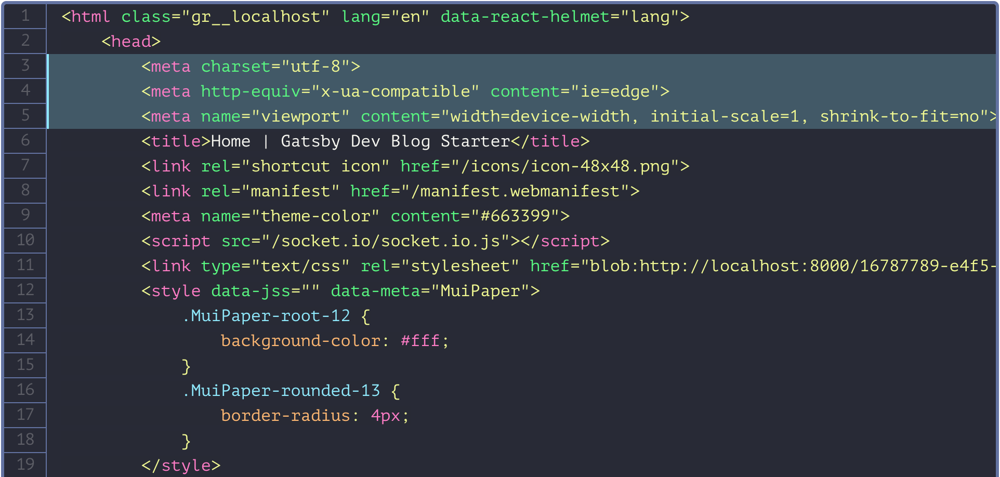
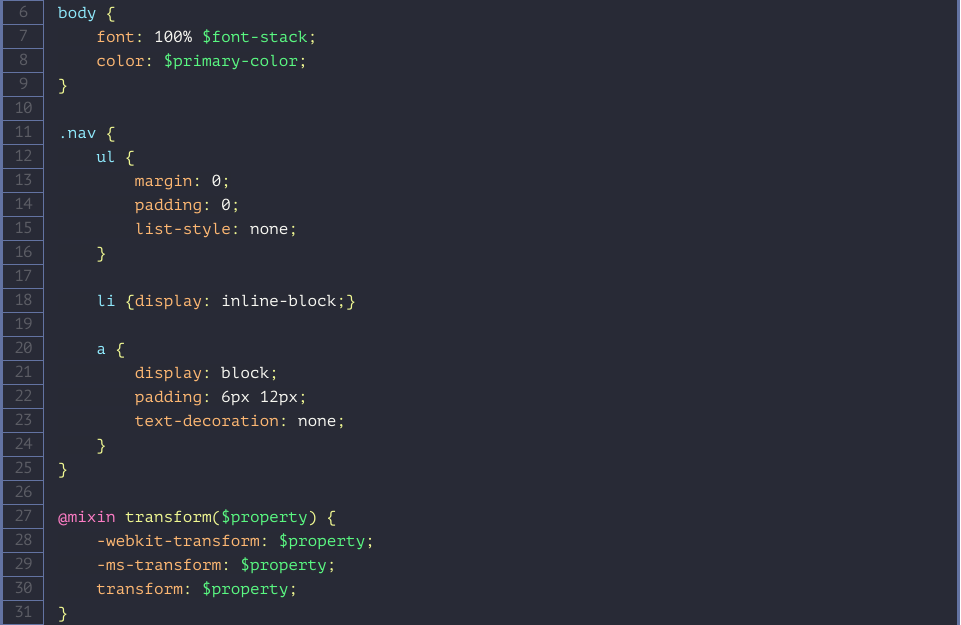
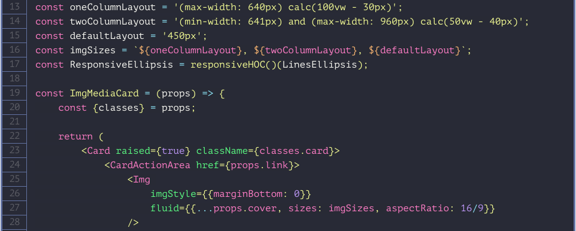

<a href="https://gatsbyjs.org">
	

		
	

</a>

<h1 align="center">
	Dracula syntax highlighting theme for Gatsby
</h1>

<a href="https://draculatheme.com">
	

		
	

</a>

A dark theme for `gatsby-remark-prismjs` plugin with pre-configured line numbers and line highlights.

## Installation

1. Assumed you have already installed and configured [gatsby-remark-prismjs](https://www.gatsbyjs.org/packages/gatsby-remark-prismjs/).
2. `npm install gatsby-prism-highlight`
3. `import gatsby-prism-highlight` in `gatsby-browser.js`.

## Screenshots

### HTML with styles

### Sass

### JSX

